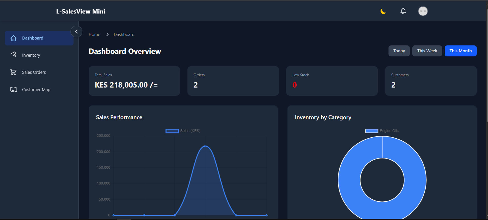
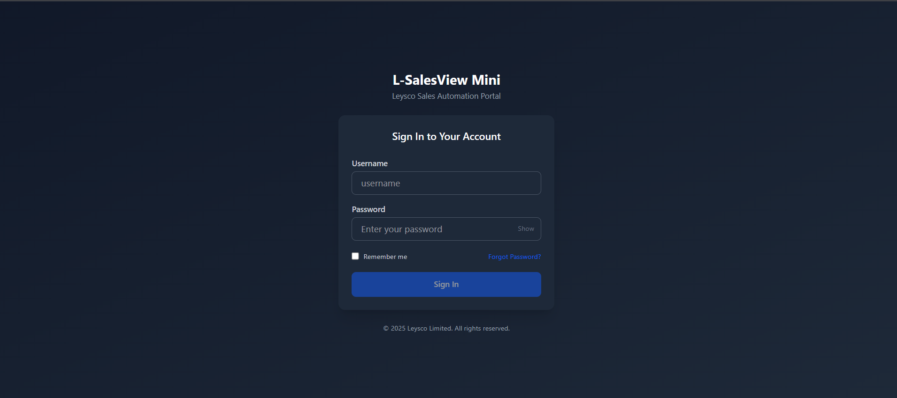
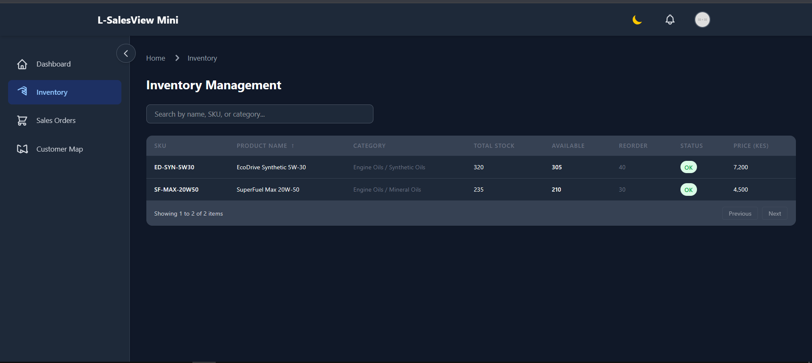
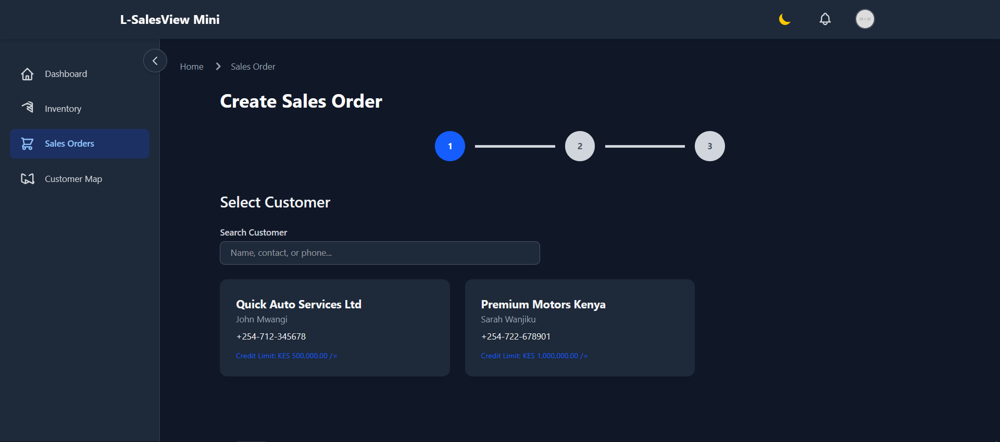
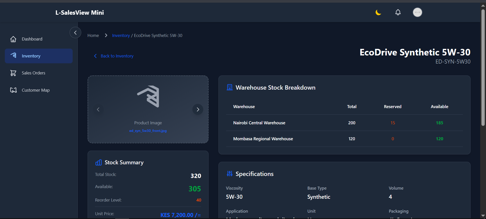
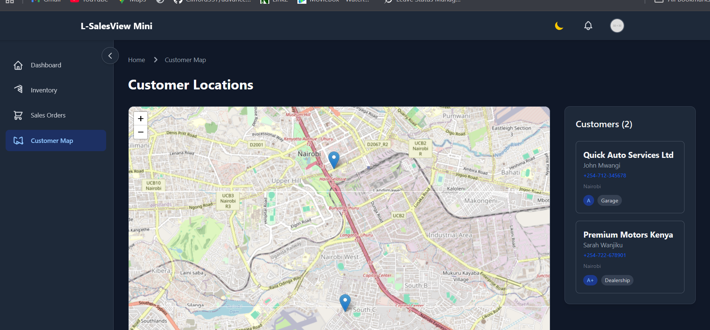

# L-SalesView Mini  
**Leysco Vue.js Technical Assessment**



A fully functional **mini sales automation portal** built with **Vue 3 (Composition API)**, **Pinia**, **Vue Router**, **Tailwind CSS**, **Chart.js**, and **Leaflet**.  
This project was developed as part of the **Leysco Frontend Developer (Vue.js) Technical Assessment**.

---

## Screenshots

> _Screenshots are illustrative placeholders. Replace with real images from the running app._

| Login | Dashboard | Inventory |
|------|-----------|-----------|
|  |  |  |

| Sales Order | Product Details | Customer Map |
|------------|-----------------|--------------|
|  |  |  |

---

## Features Implemented

###  Authentication Module
- Login with real-time form validation (password rules enforced)
- Password visibility toggle
- Simulated login throttling after failed attempts
- Loading states and inline error handling
- “Remember me” using **localStorage / sessionStorage**
- Password reset request form (UI simulation only)

---

### Dashboard Overview
- Responsive dashboard layout
- Top navbar with profile dropdown & notification badge
- Collapsible sidebar navigation
- Breadcrumb navigation
- KPI metric cards
- Interactive charts using **Chart.js**:
  - Sales performance (line chart)
  - Inventory by category (doughnut chart)
  - Top-selling products (horizontal bar chart)
- Quick time-period toggle (daily / weekly / monthly)

---

### Inventory Management
- Filterable, sortable, paginated inventory table
- Quick search functionality
- Product detail view with:
  - Multi-warehouse stock breakdown
  - Reorder level indicators
  - Batch & serial number tracking flags
  - Technical specifications
  - Related products
  - Image gallery with navigation

---

###  Sales Transaction Module
- Simulated sales order creation flow:
  - Customer search & selection
  - Product search with real-time stock availability
  - Quantity validation against stock
  - Per-line discounts (percentage)
  - Tax calculation
  - Order summary with formatted totals

---

###  Customer Map View
- Interactive **Leaflet** map
- Customer location markers from mock coordinates
- Detailed popup information
- Sidebar customer list synchronized with map

---

###  Notifications & Alerts
- Toast notifications:
  - Success
  - Error
  - Warning
  - Info
- Notification center in navbar
- Unread badge indicator

---

###  UI / UX Enhancements
- Dark / Light theme toggle with persistence
- Fully responsive design
- Smooth transitions & animations
- Professional SVG icons
- Global loading states

---

##  Technical Stack

- **Vue 3** (Composition API)
- **Pinia** – State Management
- **Vue Router** – Routing & Guards
- **Tailwind CSS** – Styling
- **Chart.js** – Data Visualization
- **Leaflet** – Maps
- **Vite** – Build Tool
 
> All custom components use the **`L-` prefix**

---

## Setup Instructions

```bash
# Install dependencies
npm install

# Start development server
npm run dev
```

App runs on:
```
http://localhost:5173
```

---

##  Test Login Credentials

| Username | Password | Role |
|--------|----------|------|
| `LEYS-1001` | `Leysco@123` | David Kariuki – Sales Manager |
| `LEYS-1002` | `Leysco@456` | Jane Njoki – Senior Sales Rep |

**Note:**  
- “Remember me” → `localStorage`  
- Unchecked → `sessionStorage`

---

## Custom Currency Formatter

Implemented `leysSalesFormatter` utility:

- Standard: `10,000.00 KES`
- **Leysco Format:** `KES 10,000.00 /=`

---

##  Assumptions

- No backend – all data loaded from mock JSON files
- Authentication is simulated
- Images are placeholders (display filenames)
- Limited dataset used intentionally to simulate real-world scenarios

---

## Project Conventions

- All custom components prefixed with **`L-`**
- Required component header comment format strictly followed
- Clean, readable, and modular component structure
- Clear Git commit history maintained throughout development

---

## Notes

- Focus was placed on **functionality, code quality, and UX**
- Business logic follows provided specifications
- Architecture designed for easy scalability

---

© 2025 **Leysco Limited** – Vue.js Technical Assessment  
